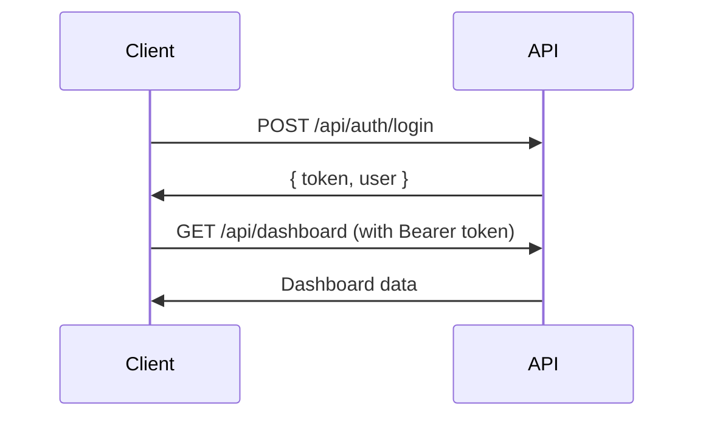

# SI-CAP API Endpoints Documentation

**SI-CAP (Sistem Informasi Capaian Pembelajaran)**  
Backend API untuk manajemen kurikulum berbasis Outcome-Based Education (OBE)

---

## 📋 Quick Info

| Info | Value |
|------|-------|
| **Base URL** | `http://localhost:8787` (development) |
| **API Version** | v1.0 |
| **Framework** | Hono + Cloudflare Workers |
| **Database** | Cloudflare D1 (SQLite) |
| **ORM** | Drizzle ORM |
| **Auth** | JWT (HS256) |
| **Runtime** | Bun / Node.js |

---

## 🚀 Quick Start

### 1. Authentication
```bash
# Login
curl -X POST http://localhost:8787/api/auth/login \
  -H "Content-Type: application/json" \
  -d '{"email":"admin@example.com","password":"password"}'

# Response: { "token": "eyJhbG...", "user": {...} }
```

### 2. Use Token for Protected Routes
```bash
curl -X GET http://localhost:8787/api/dashboard \
  -H "Authorization: Bearer YOUR_TOKEN_HERE"
```

### 3. Get Dashboard Statistics
```bash
curl -X GET http://localhost:8787/api/dashboard?id_kurikulum=KURIKULUM_ID \
  -H "Authorization: Bearer YOUR_TOKEN"
```

---

## 📚 API Endpoints Overview

### Core Entities (13 Modules)
| Module | Endpoint | Description |
|--------|----------|-------------|
| 🔐 **Auth** | `/api/auth` | Authentication & authorization |
| 📊 **Dashboard** | `/api/dashboard` | Statistics & summary data |
| 🏫 **Prodi** | `/api/prodi` | Program Studi management |
| 📖 **Kurikulum** | `/api/kurikulum` | Kurikulum management |
| 👥 **Profil Lulusan** | `/api/profil-lulusan` | Graduate profiles |
| 🎯 **KUL** | `/api/kul` | Kompetensi Utama Lulusan |
| 📝 **CPL** | `/api/cpl` | Capaian Pembelajaran Lulusan |
| 📚 **Bahan Kajian** | `/api/bahan-kajian` | Study materials |
| 📕 **Mata Kuliah** | `/api/mata-kuliah` | Courses management |
| 👨‍🏫 **Dosen** | `/api/dosen` | Lecturers management |
| ✅ **CPMK** | `/api/cpmk` | Course learning outcomes |
| 📄 **RPS** | `/api/rps` | Semester learning plans |
| 📈 **Laporan** | `/api/laporan` | Reports & analytics |

### Key Features
- ✅ **CRUD Operations** - Full Create, Read, Update, Delete
- ✅ **Matrix Management** - CPL-PL, CPL-BK, CPL-MK mappings
- ✅ **Data Enrichment** - Related data in single request (`?enrich=true`)
- ✅ **Dosen Assignment** - PJ (Penanggung Jawab) & Anggota system
- ✅ **RPS Workflow** - Draft → Submit → Validate/Reject
- ✅ **Dashboard Stats** - Comprehensive analytics
- ✅ **Search & Filter** - Query parameters support
- ✅ **Role-Based Access** - Admin, Kaprodi, Dosen

---

## 🔒 Authentication Flow



**Roles:**
- **Admin**: Full access to all endpoints
- **Kaprodi**: Manage kurikulum, validate RPS
- **Dosen**: Create/edit RPS, CPMK

---

## 📊 Data Enrichment Support

Fetch related data in single request using `?enrich=true` parameter:

| Endpoint | Enrichment | Returns |
|----------|------------|---------|
| `GET /api/cpl?enrich=true` | Profil Lulusan | CPL with `profil_list[]` |
| `GET /api/bahan-kajian?enrich=true` | CPL | Bahan Kajian with `cpl_list[]` |
| `GET /api/mata-kuliah?enrich=full` | CPL + Dosen | MK with `cpl_list[]` & `dosen_pengampu[]` |

**Example:**
```bash
curl "http://localhost:8787/api/cpl?id_kurikulum=xyz&enrich=true" \
  -H "Authorization: Bearer TOKEN"

# Response: CPL objects with profil_list populated
```

---

## 🔗 Matrix Endpoints

Manage many-to-many relationships:

### CPL-PL (CPL ↔ Profil Lulusan)
```bash
GET  /api/cpl/matrix/pl?id_kurikulum=xyz
POST /api/cpl/matrix/pl
Body: { mappings: [{ id_cpl: "...", id_profil: "..." }] }
```

### CPL-BK (CPL ↔ Bahan Kajian)
```bash
GET  /api/bahan-kajian/matrix/cpl?id_kurikulum=xyz
POST /api/bahan-kajian/matrix/cpl
Body: { mappings: [{ id_cpl: "...", id_bk: "..." }] }
```

### CPL-MK (CPL ↔ Mata Kuliah)
```bash
GET  /api/mata-kuliah/matrix/cpl?id_kurikulum=xyz
POST /api/mata-kuliah/matrix/cpl
Body: { mappings: [{ id_cpl: "...", id_mk: "..." }] }
```

---

## 👨‍🏫 Dosen Assignment System

Assign lecturers to courses with PJ/Anggota roles:

```bash
POST /api/mata-kuliah/:id/dosen
Body: {
  "dosen_ids": ["dosen_1", "dosen_2", "dosen_3"],
  "tahun_akademik": "2024/2025",
  "semester_akademik": "Ganjil",
  "koordinator_id": "dosen_1"  // First dosen = PJ (Penanggung Jawab)
}
```

**Rules:**
- First dosen OR `koordinator_id` = **PJ (Penanggung Jawab)** - Coordinator
- Other dosen = **Anggota** - Team members

---

## 📈 Dashboard Statistics

Get comprehensive analytics:

```bash
GET /api/dashboard?id_kurikulum=xyz
```

**Returns:**
```json
{
  "kurikulum": { "total": 5, "selected_id": "xyz" },
  "summary": {
    "total_profil_lulusan": 10,
    "total_kompetensi_utama": 25,
    "total_cpl": 30,
    "total_bahan_kajian": 15,
    "total_mata_kuliah": 40,
    "total_dosen": 20,
    "total_cpmk": 120,
    "total_rps": 38,
    "total_sks": 144
  },
  "statistics": {
    "cpl_by_aspek": { "S": 8, "P": 10, "KU": 7, "KK": 5 },
    "mk_by_semester": [...],
    "mk_by_sifat": { "Wajib": 35, "Pilihan": 5 },
    "rps_by_status": { "Draft": 10, "Terbit": 28 }
  },
  "matrix": {
    "total_cpl_pl": 45,
    "total_cpl_bk": 60,
    "total_cpl_mk": 150
  }
}
```

---

## Response Format (Global)
- Success:
  - success: true
  - data: object | array
  - message?: string
  - meta?: { page, limit, total, totalPages }
- Error:
  - success: false
  - error: string
  - details?: array

## Frontend Field Mapping Notes
- Backend `id` field → Frontend expects specific ID field (e.g., `id_prodi`, `id_kurikulum`)
- Date fields should be ISO string or Unix timestamp
- Frontend will handle date conversion via `toDate()` utility

## Auth
- POST /api/auth/register
  - Body: { email, password, nama, role?, id_prodi? }
  - Response: { token? , user? } (see login for token)
- POST /api/auth/login
  - Body: { email, password }
  - Response: { token, user }
- POST /api/auth/refresh
  - Headers: Authorization: Bearer <token>
  - Response: { token }
- GET /api/auth/me
  - Headers: Authorization: Bearer <token>
  - Response: user profile
- POST /api/auth/change-password
  - Headers: Authorization: Bearer <token>
  - Body: { old_password, new_password }
- POST /api/auth/logout
  - Response: message

## Dashboard
- GET /api/dashboard
  - Query: id_kurikulum? (optional, defaults to active kurikulum)
  - Response: Dashboard statistics and summary
  - Data includes:
    - kurikulum: { total, selected_id }
    - summary: { total_profil_lulusan, total_kompetensi_utama, total_cpl, total_bahan_kajian, total_mata_kuliah, total_dosen, total_cpmk, total_rps, total_sks }
    - statistics: { cpl_by_aspek, kul_by_aspek, bk_by_aspek, mk_by_semester, mk_by_sifat, rps_by_status, dosen_by_jabatan }
    - matrix: { total_cpl_pl, total_cpl_bk, total_cpl_mk }
- GET /api/dashboard/recent
  - Query: limit? (default 10)
  - Response: Recent activities { recent_rps, recent_mata_kuliah }

## Prodi
- GET /api/prodi
  - Query: none
  - Response: Array of Prodi objects
- GET /api/prodi/:id
  - Response: Single Prodi object
- POST /api/prodi (admin)
  - Body: { kode_prodi, nama_prodi, fakultas, jenjang, akreditasi? }
  - Response: Created Prodi object
- PUT /api/prodi/:id (admin)
  - Body: partial fields above
  - Response: Updated Prodi object
- DELETE /api/prodi/:id (admin)
  - Response: Success message

**Prodi Object (Backend → Frontend):**
```json
{
  "id": "string",              // Backend field → Frontend: id_prodi
  "kode_prodi": "string",      // Optional
  "nama_prodi": "string",      // Required
  "fakultas": "string",        // Optional
  "jenjang": "string",         // Optional
  "akreditasi": "string",      // Optional
  "created_at": "date",        // ISO string or timestamp
  "updated_at": "date"         // ISO string or timestamp
}
```

## Kurikulum
- GET /api/kurikulum
  - Query: id_prodi?, is_active? (true|false)
  - Response: Array of Kurikulum objects
- GET /api/kurikulum/:id
  - Response: Single Kurikulum object
- POST /api/kurikulum (admin, kaprodi)
  - Body: { nama_kurikulum, tahun_berlaku, id_prodi, is_active? }
  - Response: Created Kurikulum object
- PUT /api/kurikulum/:id (admin, kaprodi)
  - Body: partial fields above
  - Response: Updated Kurikulum object
- DELETE /api/kurikulum/:id (admin, kaprodi)
  - Response: Success message
- PATCH /api/kurikulum/:id/activate (admin, kaprodi)
  - Response: Updated Kurikulum object with is_active = true

**Kurikulum Object (Backend → Frontend):**
```json
{
  "id": "string",              // Backend field → Frontend: id_kurikulum
  "id_kurikulum": "string",    // Alternative backend field
  "nama_kurikulum": "string",  // Required
  "tahun_berlaku": number,     // Required (year as integer)
  "is_active": boolean,        // Required (default: false)
  "id_prodi": "string",        // Optional but recommended
  "created_at": "date",        // ISO string or timestamp
  "updated_at": "date"         // ISO string or timestamp
}
```

## Profil Lulusan
- GET /api/profil-lulusan
  - Query: id_kurikulum?
  - Response: Array of Profil Lulusan objects
- GET /api/profil-lulusan/kurikulum/:id
  - Response: Array of Profil Lulusan for specific Kurikulum
- GET /api/profil-lulusan/:id
  - Response: Single Profil Lulusan object
- POST /api/profil-lulusan (admin, kaprodi)
  - Body: { kode_profil, profil_lulusan, deskripsi, sumber, id_kurikulum }
  - Response: Created Profil Lulusan object
- PUT /api/profil-lulusan/:id (admin, kaprodi)
  - Body: partial fields above
  - Response: Updated Profil Lulusan object
- DELETE /api/profil-lulusan/:id (admin, kaprodi)
  - Response: Success message

**Profil Lulusan Object (Backend → Frontend):**
```json
{
  "id": "string",              // Backend field → Frontend: id_profil
  "kode_profil": "string",     // Required
  "profil_lulusan": "string",  // Required
  "deskripsi": "string",       // Required
  "sumber": "string",          // Required
  "id_kurikulum": "string",    // Required
  "created_at": "date",
  "updated_at": "date"
}
```

## KUL (Kompetensi Utama Lulusan)
- GET /api/kul
  - Query: id_kurikulum?
  - Response: Array of KUL objects
- GET /api/kul/:id
  - Response: Single KUL object
- POST /api/kul (admin, kaprodi)
  - Body: { kode_kul, kompetensi_lulusan, aspek, id_kurikulum }
  - Response: Created KUL object
- PUT /api/kul/:id (admin, kaprodi)
  - Body: partial fields above
  - Response: Updated KUL object
- DELETE /api/kul/:id (admin, kaprodi)
  - Response: Success message

**KUL Object (Backend → Frontend):**
```json
{
  "id": "string",              // Backend field → Frontend: id_kul
  "kode_kul": "string",        // Required
  "kompetensi_lulusan": "string", // Required
  "aspek": "string",           // Required: "Sikap" | "Pengetahuan" | "Keterampilan Umum" | "Keterampilan Khusus"
  "id_kurikulum": "string",    // Required
  "created_at": "date",
  "updated_at": "date"
}
```

## CPL
- GET /api/cpl
  - Query: id_kurikulum?, aspek?, enrich? (true|profil)
  - Response: Array of CPL objects (enriched with profil_list if enrich=true)
- GET /api/cpl/:id
  - Response: Single CPL object
- POST /api/cpl (admin, kaprodi)
  - Body: { kode_cpl, deskripsi_cpl, aspek, id_kurikulum }
  - Response: Created CPL object
- PUT /api/cpl/:id (admin, kaprodi)
  - Body: partial fields above
  - Response: Updated CPL object
- DELETE /api/cpl/:id (admin, kaprodi)
  - Response: Success message
- GET /api/cpl/matrix/pl
  - Query: id_kurikulum
  - Response: Matrix mapping data { cplList, plList, matrix, mappings }
- POST /api/cpl/matrix/pl (admin, kaprodi)
  - Body: { mappings: [{ id_cpl, id_profil }] }
  - Response: Success message

**CPL Object (Backend → Frontend):**
```json
{
  "id": "string",              // Backend field → Frontend: id_cpl
  "kode_cpl": "string",        // Required
  "deskripsi_cpl": "string",   // Required
  "aspek": "string",           // Required: "S" | "P" | "KU" | "KK"
  "id_kurikulum": "string",    // Required
  "profil_list": [],           // Optional: Array of Profil Lulusan (if enrich=true)
  "created_at": "date",
  "updated_at": "date"
}
```

## Bahan Kajian
- GET /api/bahan-kajian
  - Query: id_kurikulum?, aspek?, enrich? (true|cpl)
  - Response: Array of Bahan Kajian objects (enriched with cpl_list if enrich=true)
- GET /api/bahan-kajian/:id
  - Response: Single Bahan Kajian object
- POST /api/bahan-kajian (admin, kaprodi)
  - Body: { kode_bk, nama_bahan_kajian, aspek, ranah_keilmuan, id_kurikulum }
  - Response: Created Bahan Kajian object
- PUT /api/bahan-kajian/:id (admin, kaprodi)
  - Body: partial fields above
  - Response: Updated Bahan Kajian object
- DELETE /api/bahan-kajian/:id (admin, kaprodi)
  - Response: Success message
- GET /api/bahan-kajian/matrix/cpl
  - Query: id_kurikulum
  - Response: Matrix mapping data
- POST /api/bahan-kajian/matrix/cpl (admin, kaprodi)
  - Body: { mappings: [{ id_cpl, id_bk }] }
  - Response: Success message

**Bahan Kajian Object (Backend → Frontend):**
```json
{
  "id": "string",                // Backend field → Frontend: id_bahan_kajian
  "kode_bk": "string",           // Required
  "nama_bahan_kajian": "string", // Required
  "aspek": "string",             // Required: "Sikap" | "Pengetahuan" | "Keterampilan Umum" | "Keterampilan Khusus"
  "ranah_keilmuan": "string",    // Required
  "id_kurikulum": "string",      // Required
  "created_at": "date",
  "updated_at": "date"
}
```

## Mata Kuliah
- GET /api/mata-kuliah
  - Query: id_kurikulum?, semester?, sifat?, enrich? (true|full)
  - Response: Array of Mata Kuliah objects (enriched with cpl_list and dosen_pengampu if enrich=true)
- GET /api/mata-kuliah/semester/:semester
  - Query: id_kurikulum
  - Response: Array of Mata Kuliah for specific semester
- GET /api/mata-kuliah/:id
  - Response: Single Mata Kuliah object
- POST /api/mata-kuliah (admin, kaprodi)
  - Body: { kode_mk, nama_mk, sks, semester, sifat, deskripsi?, id_kurikulum, id_bahan_kajian? }
  - Response: Created Mata Kuliah object
- PUT /api/mata-kuliah/:id (admin, kaprodi)
  - Body: partial fields above
  - Response: Updated Mata Kuliah object
- DELETE /api/mata-kuliah/:id (admin, kaprodi)
  - Response: Success message
- GET /api/mata-kuliah/matrix/cpl
  - Query: id_kurikulum
  - Response: Matrix mapping data { cplList, mkList, matrix, mappings }
- POST /api/mata-kuliah/matrix/cpl (admin, kaprodi)
  - Body: { mappings: [{ id_cpl, id_mk }] }
  - Response: Success message
- GET /api/mata-kuliah/:id/dosen
  - Query: tahun_akademik?, semester_akademik?
  - Response: Array of assigned dosen with koordinator status
- POST /api/mata-kuliah/:id/dosen (admin, kaprodi)
  - Body: { dosen_ids: [string], tahun_akademik, semester_akademik, koordinator_id? }
  - Response: Success message
  - Note: First dosen in array becomes PJ (Penanggung Jawab), others are Anggota
- DELETE /api/mata-kuliah/:id/dosen/:dosenId (admin, kaprodi)
  - Query: tahun_akademik?, semester_akademik?
  - Response: Success message

**Mata Kuliah Object (Backend → Frontend):**
```json
{
  "id": "string",              // Backend field → Frontend: id_mk
  "kode_mk": "string",         // Required
  "nama_mk": "string",         // Required
  "sks": number,               // Required (1-6)
  "semester": number,          // Required (1-8)
  "sifat": "string",           // Required: "Wajib" | "Pilihan"
  "deskripsi": "string",       // Optional
  "id_kurikulum": "string",    // Required
  "id_bahan_kajian": "string", // Optional
  "bahan_kajian": {},          // Optional: Bahan Kajian object (joined)
  "cpl_list": [],              // Optional: Array of CPL (if enrich=true)
  "dosen_pengampu": [],        // Optional: Array of Dosen with is_koordinator flag (if enrich=true)
  "created_at": "date",
  "updated_at": "date"
}
```

## Dosen
- GET /api/dosen
  - Query: id_prodi?
  - Response: Array of Dosen objects
- GET /api/dosen/search
  - Query: q?, id_prodi?
  - Response: Array of Dosen objects matching search
- GET /api/dosen/:id
  - Response: Single Dosen object
- GET /api/dosen/:id/mata-kuliah
  - Query: tahun_akademik?, semester_akademik?
  - Response: Array of Mata Kuliah assigned to Dosen
- POST /api/dosen (admin, kaprodi)
  - Body: { nip, nama_dosen, email?, bidang_keahlian, jabatan_fungsional, id_prodi, id_user? }
  - Response: Created Dosen object
- PUT /api/dosen/:id (admin, kaprodi)
  - Body: partial fields above
  - Response: Updated Dosen object
- DELETE /api/dosen/:id (admin, kaprodi)
  - Response: Success message

**Dosen Object (Backend → Frontend):**
```json
{
  "id": "string",                // Backend field → Frontend: id_dosen
  "nip": "string",               // Required
  "nama_dosen": "string",        // Required
  "email": "string",             // Optional
  "bidang_keahlian": "string",   // Optional
  "jabatan_fungsional": "string",// Optional
  "created_at": "date",
  "updated_at": "date"
}
```

## CPMK
- GET /api/cpmk
  - Query: id_mk?
  - Response: Array of CPMK objects
- GET /api/cpmk/mata-kuliah/:id
  - Response: Array of CPMK objects for specific Mata Kuliah
- GET /api/cpmk/:id
  - Response: Single CPMK object
- POST /api/cpmk (admin, kaprodi, dosen)
  - Body: { kode_cpmk, deskripsi_cpmk, bobot_persentase, id_mk, id_cpl }
  - Response: Created CPMK object
- PUT /api/cpmk/:id (admin, kaprodi, dosen)
  - Body: partial fields above
  - Response: Updated CPMK object
- DELETE /api/cpmk/:id (admin, kaprodi, dosen)
  - Response: Success message
- POST /api/cpmk/:id/sub (admin, kaprodi, dosen)
  - Body: { kode_sub, deskripsi_sub_cpmk, indikator, kriteria_penilaian }
  - Response: Created SubCPMK object
- PUT /api/cpmk/:id/sub/:subId (admin, kaprodi, dosen)
  - Body: partial fields above
  - Response: Updated SubCPMK object
- DELETE /api/cpmk/:id/sub/:subId (admin, kaprodi, dosen)
  - Response: Success message

**CPMK Object (Backend → Frontend):**
```json
{
  "id": "string",              // Backend field → Frontend: id_cpmk
  "kode_cpmk": "string",       // Required
  "deskripsi_cpmk": "string",  // Required
  "bobot_persentase": number,  // Required (0-100)
  "kode_mk": "string",         // Optional (from Mata Kuliah relation)
  "id_mk": "string",           // Optional
  "id_cpl": "string",          // Required
  "created_at": "date",
  "updated_at": "date"
}
```

**SubCPMK Object (Backend → Frontend):**
```json
{
  "id": "string",                    // Backend field → Frontend: id_sub_cpmk
  "kode_sub": "string",              // Required
  "deskripsi_sub_cpmk": "string",    // Required
  "indikator": "string",             // Required
  "kriteria_penilaian": "string",    // Required
  "id_cpmk": "string",               // Required
  "created_at": "date",
  "updated_at": "date"
}
```

## RPS
- GET /api/rps
  - Query: id_mk?, id_kurikulum?, status?
  - Response: Array of RPS objects
- GET /api/rps/:id
  - Response: Single RPS object
- POST /api/rps (admin, kaprodi, dosen)
  - Body: { id_mk, tahun_akademik, semester_akademik, deskripsi_mk?, pustaka_utama?, pustaka_pendukung?, id_koordinator? }
  - Response: Created RPS object
- PUT /api/rps/:id (admin, kaprodi, dosen)
  - Body: partial fields above
  - Response: Updated RPS object
- DELETE /api/rps/:id (admin, kaprodi, dosen)
  - Response: Success message
- POST /api/rps/:id/minggu (admin, kaprodi, dosen)
  - Body: { minggu_ke, id_sub_cpmk?, materi, metode_pembelajaran?, waktu_menit?, pengalaman_belajar?, bentuk_penilaian?, bobot_penilaian? }
  - Response: Created RPS Minggu object
- PUT /api/rps/:id/minggu/:mingguId (admin, kaprodi, dosen)
  - Body: partial fields above
  - Response: Updated RPS Minggu object
- DELETE /api/rps/:id/minggu/:mingguId (admin, kaprodi, dosen)
  - Response: Success message
- POST /api/rps/:id/submit (dosen)
  - Body: { id_kaprodi }
  - Response: Updated RPS with status change
- POST /api/rps/:id/validate (kaprodi)
  - Body: { catatan? }
  - Response: Updated RPS with status = "Terbit"
- POST /api/rps/:id/reject (kaprodi)
  - Body: { catatan? }
  - Response: Updated RPS with status = "Draft"

**RPS Object (Backend → Frontend):**
```json
{
  "id": "string",              // Backend field → Frontend: id_rps
  "id_mk": "string",           // Optional
  "kode_mk": "string",         // Optional (from Mata Kuliah relation)
  "versi": number,             // Required (default: 1)
  "tgl_penyusunan": "date",    // ISO string or timestamp
  "dosen_pengampu": "string",  // Required
  "status": "string",          // Required: "Draft" | "Menunggu Validasi" | "Terbit"
  "created_at": "date",
  "updated_at": "date"
}
```

## Laporan
- GET /api/laporan/matrix-cpl-mk
  - Query: id_kurikulum
  - Response: Array of report objects
- GET /api/laporan/matrix-cpl-bk
  - Query: id_kurikulum
  - Response: Array of report objects
- GET /api/laporan/matrix-cpl-pl
  - Query: id_kurikulum
  - Response: Array of report objects
- GET /api/laporan/progress-cpl
  - Query: id_kurikulum, id_mk?
  - Response: Array of progress report objects

**Laporan Matrix CPL-MK Response:**
```json
[
  {
    "kode_mk": "string",
    "nama_mk": "string",
    "total_cpmk": number,
    "total_cpl": number,
    "rata_rata_bobot": number
  }
]
```

**Laporan Progress CPL Response:**
```json
[
  {
    "id_cpl": "string",
    "nama_cpl": "string",
    "bobot": number,
    "total_mk": number
  }
]
```

**Laporan Per Tahun Response:**
```json
[
  {
    "tahun": number,
    "total_kurikulum": number,
    "total_cpl": number,
    "total_mk": number
  }
]
```

## Health Check
- GET /
- GET /health

## Headers
- Authorization: Bearer <token> (for protected routes)
- Content-Type: application/json

---

## IMPORTANT NOTES FOR BACKEND DEVELOPERS

### Field Mapping Convention
Backend MUST return `id` field in response, Frontend will map it to entity-specific ID:
- `id` → `id_prodi` (Prodi)
- `id` → `id_kurikulum` (Kurikulum)
- `id` → `id_profil` (Profil Lulusan)
- `id` → `id_kul` (Kompetensi Utama Lulusan)
- `id` → `id_cpl` (CPL)
- `id` → `id_bahan_kajian` (Bahan Kajian)
- `id` → `id_mk` (Mata Kuliah)
- `id` → `id_dosen` (Dosen)
- `id` → `id_cpmk` (CPMK)
- `id` → `id_sub_cpmk` (Sub CPMK)
- `id` → `id_rps` (RPS)
- `id` → `id_penilaian` (Penilaian)

### Date Fields
- Backend can return dates as ISO string (`"2024-01-01T00:00:00.000Z"`) or Unix timestamp
- Frontend will convert via `toDate()` utility function
- Fields: `created_at`, `updated_at`, `tgl_penyusunan`

### Enum Values
**AspekCPL / AspekKUL:**
- "Sikap"
- "Pengetahuan"
- "Keterampilan Umum"
- "Keterampilan Khusus"

**SifatMK (Mata Kuliah):**
- "Wajib"
- "Pilihan"
- "MKWK"

**Status RPS:**
- "Draft"
- "Menunggu Validasi"
- "Terbit"

### Required vs Optional Fields
- Fields marked with `?` in Body are optional
- All `id`, `kode_*`, `nama_*`, `deskripsi_*` are typically required
- `created_at` and `updated_at` are auto-generated, optional in requests
- Foreign keys (`id_kurikulum`, `id_prodi`, etc.) are required where specified

### Response Wrapping
All successful responses should be wrapped in:
```json
{
  "success": true,
  "data": { ... } or [ ... ],
  "message": "Optional success message"
}
```

All error responses should be:
```json
{
  "success": false,
  "error": "Error message",
  "details": [] // Optional array of error details
}
```

### Pagination (if implemented)
```json
{
  "success": true,
  "data": [ ... ],
  "meta": {
    "page": 1,
    "limit": 10,
    "total": 100,
    "totalPages": 10
  }
}
```

---

## 🧪 Testing Guide

### Using cURL

#### 1. Login & Get Token
```bash
curl -X POST http://localhost:8787/api/auth/login \
  -H "Content-Type: application/json" \
  -d '{
    "email": "admin@example.com",
    "password": "password123"
  }'

# Save token from response
export TOKEN="eyJhbGciOiJIUzI1NiIsInR5cCI6IkpXVCJ9..."
```

#### 2. Test Dashboard
```bash
curl -X GET http://localhost:8787/api/dashboard \
  -H "Authorization: Bearer $TOKEN"
```

#### 3. Test Enriched Data
```bash
# Get CPL with Profil Lulusan
curl -X GET "http://localhost:8787/api/cpl?enrich=true&id_kurikulum=KURIKULUM_ID" \
  -H "Authorization: Bearer $TOKEN"

# Get Mata Kuliah with CPL & Dosen
curl -X GET "http://localhost:8787/api/mata-kuliah?enrich=full&id_kurikulum=KURIKULUM_ID" \
  -H "Authorization: Bearer $TOKEN"
```

#### 4. Test Matrix Operations
```bash
# Get Matrix CPL-PL
curl -X GET "http://localhost:8787/api/cpl/matrix/pl?id_kurikulum=KURIKULUM_ID" \
  -H "Authorization: Bearer $TOKEN"

# Save Matrix CPL-PL
curl -X POST http://localhost:8787/api/cpl/matrix/pl \
  -H "Authorization: Bearer $TOKEN" \
  -H "Content-Type: application/json" \
  -d '{
    "mappings": [
      { "id_cpl": "cpl_1", "id_profil": "profil_1" },
      { "id_cpl": "cpl_1", "id_profil": "profil_2" }
    ]
  }'
```

#### 5. Test Dosen Assignment
```bash
curl -X POST http://localhost:8787/api/mata-kuliah/MK_ID/dosen \
  -H "Authorization: Bearer $TOKEN" \
  -H "Content-Type: application/json" \
  -d '{
    "dosen_ids": ["dosen_1", "dosen_2", "dosen_3"],
    "tahun_akademik": "2024/2025",
    "semester_akademik": "Ganjil",
    "koordinator_id": "dosen_1"
  }'
```

#### 6. Test CRUD Operations
```bash
# CREATE
curl -X POST http://localhost:8787/api/prodi \
  -H "Authorization: Bearer $TOKEN" \
  -H "Content-Type: application/json" \
  -d '{
    "kode_prodi": "MI",
    "nama_prodi": "Manajemen Informatika",
    "fakultas": "Ilmu Komputer",
    "jenjang": "D3"
  }'

# READ
curl -X GET http://localhost:8787/api/prodi \
  -H "Authorization: Bearer $TOKEN"

# UPDATE
curl -X PUT http://localhost:8787/api/prodi/PRODI_ID \
  -H "Authorization: Bearer $TOKEN" \
  -H "Content-Type: application/json" \
  -d '{
    "nama_prodi": "Manajemen Informatika (Updated)"
  }'

# DELETE
curl -X DELETE http://localhost:8787/api/prodi/PRODI_ID \
  -H "Authorization: Bearer $TOKEN"
```

### Using Postman

1. Import collection: `postman/SI-CAP-API.postman_collection.json`
2. Set environment variables:
   - `base_url`: `http://localhost:8787`
   - `token`: (will be set after login)
3. Run "Auth → Login" to get token
4. Token will auto-populate for other requests

---

## 🐛 Troubleshooting

### Common Issues

#### 1. 401 Unauthorized
**Problem:** `{ "success": false, "error": "Token tidak ditemukan" }`

**Solution:**
- Check if Authorization header is present
- Format: `Authorization: Bearer YOUR_TOKEN`
- Ensure token is valid (not expired)
- Use `/api/auth/refresh` to get new token

#### 2. 404 Not Found
**Problem:** `{ "success": false, "error": "Not Found" }`

**Solution:**
- Verify endpoint URL is correct
- Check if entity ID exists in database
- Ensure API is running: `curl http://localhost:8787/health`

#### 3. 500 Internal Server Error
**Problem:** Generic server error

**Solution:**
- Check server logs for detailed error
- Verify database connection (Cloudflare D1)
- Ensure required environment variables are set:
  - `JWT_SECRET`
  - `DB` (D1 binding)

#### 4. Empty Response Data
**Problem:** `{ "success": true, "data": [] }`

**Solution:**
- Database might be empty - seed with test data
- Check query filters (e.g., `id_kurikulum` might not match)
- Verify relationships exist (for enriched queries)

#### 5. TypeScript Errors
**Problem:** Compilation fails

**Solution:**
```bash
# Check types
bun run typecheck

# Common fixes:
# - Add missing imports (e.g., 'and' from drizzle-orm)
# - Update function signatures
# - Check JWT verify algorithm parameter
```

---

## 🚀 Development Commands

```bash
# Install dependencies
bun install

# Type checking
bun run typecheck

# Run development server
bun run dev

# Database migrations
bun run db:generate    # Generate migration files
bun run db:migrate     # Apply migrations
bun run db:push        # Push schema changes

# Deployment
bun run deploy         # Deploy to Cloudflare Workers
```

---

## 📝 Environment Variables

Create `.dev.vars` file (development):
```env
JWT_SECRET=your-super-secret-jwt-key-here-min-32-chars
ENVIRONMENT=development
```

For production, set in Cloudflare Workers dashboard:
- `JWT_SECRET` - Secret key for JWT signing
- `DB` - D1 Database binding (auto-configured)

---

## 📚 Additional Resources

### Documentation
- **Backend Guide**: See `AGENT.md` for detailed implementation
- **Frontend Guide**: See `Frontend.md` for frontend integration
- **Update Summary**: See `BACKEND-UPDATE-SUMMARY.md` for recent changes
- **Postman Collection**: `postman/SI-CAP-API.postman_collection.json`

### Tech Stack
- **Framework**: [Hono](https://hono.dev) - Ultra-fast web framework
- **Runtime**: [Cloudflare Workers](https://workers.cloudflare.com)
- **Database**: [Cloudflare D1](https://developers.cloudflare.com/d1)
- **ORM**: [Drizzle ORM](https://orm.drizzle.team)
- **Validation**: [Zod](https://zod.dev)
- **Auth**: JWT (HS256)

### Support
- Repository: [GitHub URL]
- Issues: [GitHub Issues URL]
- Documentation: This file (API-ENDPOINTS.md)

---

## 📊 Performance Tips

### 1. Use Data Enrichment
Instead of multiple requests:
```bash
# ❌ Bad: 3 separate requests
GET /api/mata-kuliah
GET /api/cpl?id_mk=...
GET /api/dosen?id_mk=...

# ✅ Good: 1 enriched request
GET /api/mata-kuliah?enrich=full
```

### 2. Filter on Server
```bash
# ✅ Good: Filter with query params
GET /api/mata-kuliah?id_kurikulum=xyz&semester=1&sifat=Wajib

# ❌ Bad: Fetch all, filter on client
GET /api/mata-kuliah
```

### 3. Use Specific Endpoints
```bash
# ✅ Good: Specific endpoint
GET /api/mata-kuliah/kurikulum/:id

# ❌ Less efficient: Generic with filter
GET /api/mata-kuliah?id_kurikulum=:id
```

---

## 🎯 Best Practices

### API Usage
1. **Always include Authorization header** for protected routes
2. **Use enrichment** (`?enrich=true`) to reduce requests
3. **Filter data server-side** with query parameters
4. **Handle errors gracefully** - check `success` field
5. **Cache dashboard data** - it's expensive to compute
6. **Validate input** before sending to API
7. **Use specific ID endpoints** when fetching single entity

### Security
1. **Never expose JWT_SECRET** in client code
2. **Store tokens securely** (httpOnly cookies recommended)
3. **Refresh tokens** before expiry
4. **Validate user role** before showing UI elements
5. **Use HTTPS** in production
6. **Implement rate limiting** on auth endpoints
7. **Log out on 401** responses

### Error Handling
```typescript
// Frontend example
try {
  const response = await api.get('/dashboard');
  if (response.data.success) {
    setData(response.data.data);
  } else {
    showError(response.data.error);
  }
} catch (error) {
  if (error.response?.status === 401) {
    // Token expired - logout
    logout();
  } else {
    showError('Network error');
  }
}
```

---

**Last Updated:** February 9, 2026  
**API Version:** 1.0.0  
**Documentation Version:** 2.0  
**Status:** ✅ Production Ready

---

_For detailed implementation guide, see AGENT.md_  
_For frontend integration, see Frontend.md_  
_For recent updates, see BACKEND-UPDATE-SUMMARY.md_
